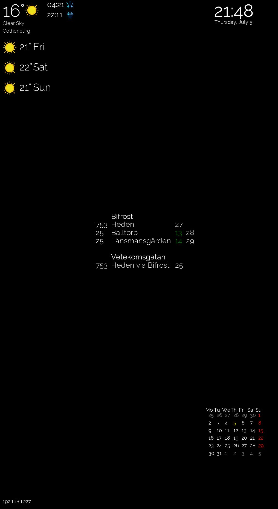

## **Magic Mirror**
Modular magic mirror display written in python based on Pygame.

#### Requirements:
    - pygame
    - click (arguments)
    - vtjp (for vasstrafik module)
    
#### Usage:
>python3 main.py [--help] [-f] [--fullscreen] [-r width height] [--resolution width height] 

>python3 main.py (with default window size)

>python3 main.py --fullscreen 

